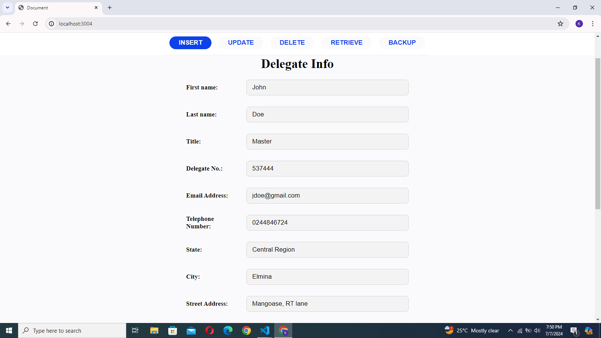
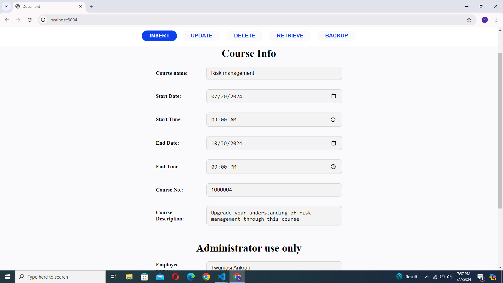
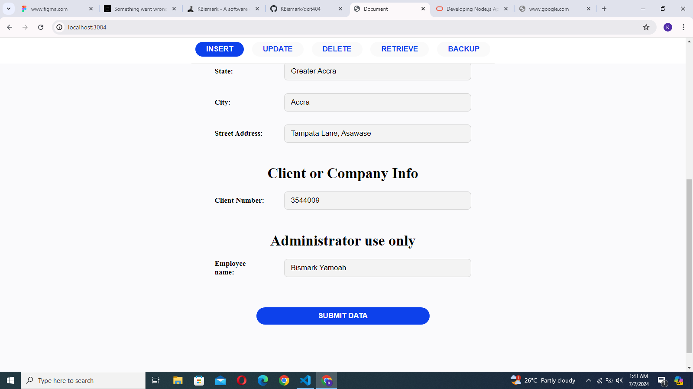
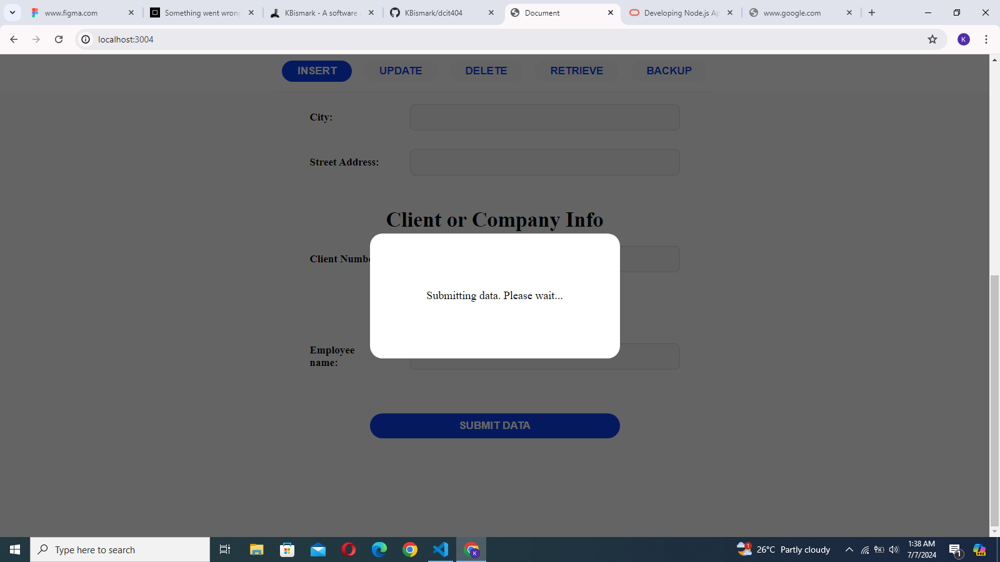
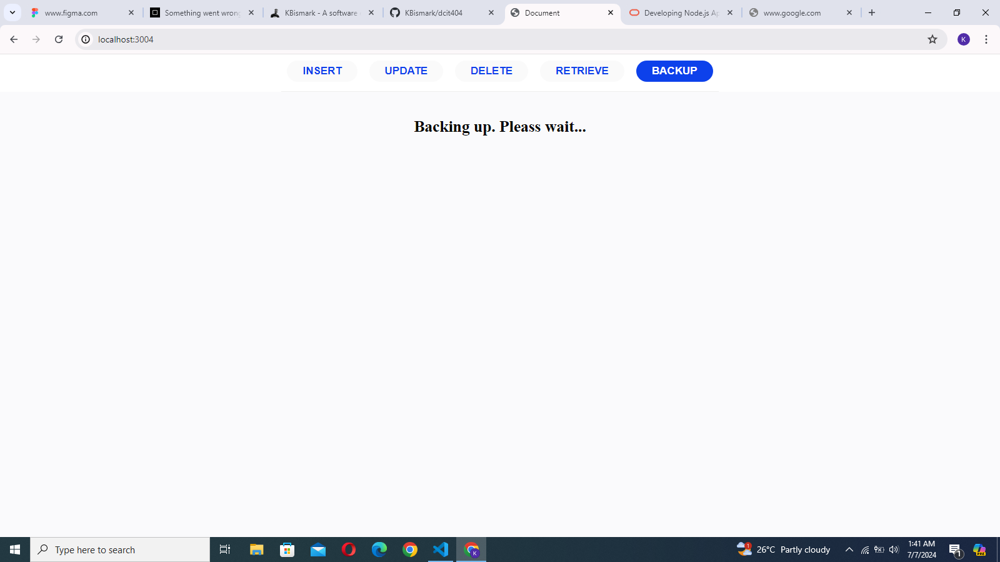
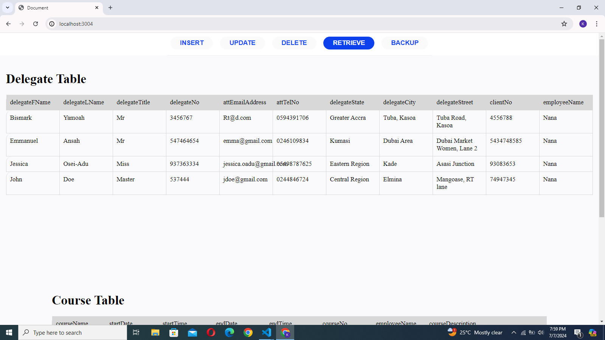
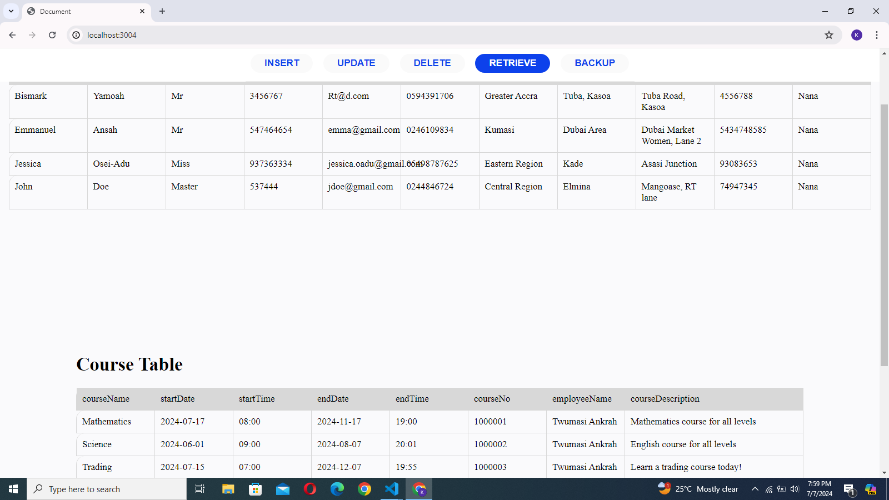
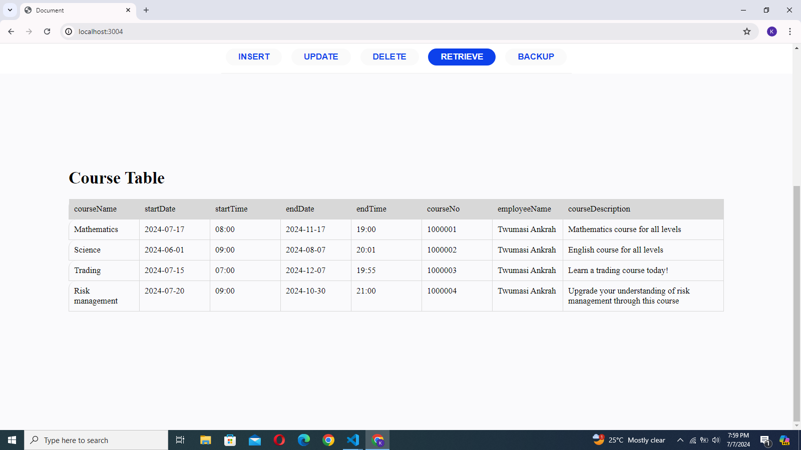

# dcit404
A simple implementaion of PL/SQL using HTM/CSS/JS for user interface and Nodejs (oracledb) for interaction with the oracle database.    

## Group Members' names and student IDs
- Bismark Yamoah - 10900095
- Quagraine Augustine PaaSam - 10909098
- Abdul-Salam Hudu - 10892303

## How to run this application
- Clone this repo
- Navigate to the root directory
- Run `npm install` in the terminal.
- Create a file named `.env` in the project root directory and paste the text bellow into the file. 
However, you must change the values to the right values.    
    
```env
USER=dcit404
PASSWORD=1234
CONNECTION_STRING=localhost/xepdb1    

```

- After a successful installation, run `npm start` to start the application
- Finally, open http:localhost:3004/ in the browser to access the user interface

## Demostration Images
>     

>  

>  

>  

>  

>  

>     

>      

